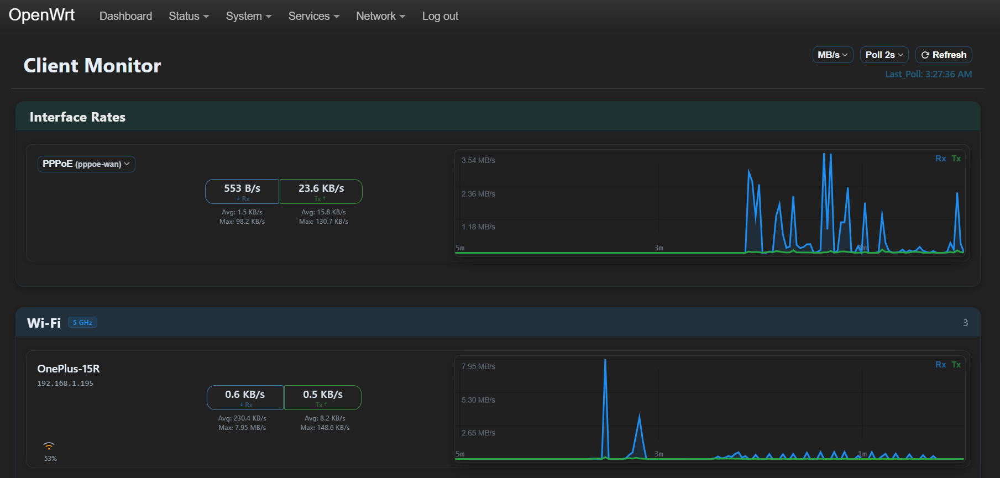
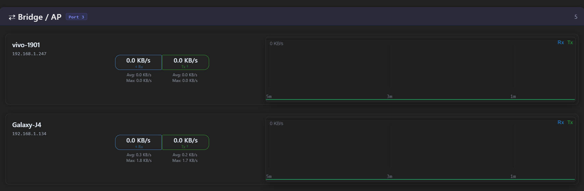
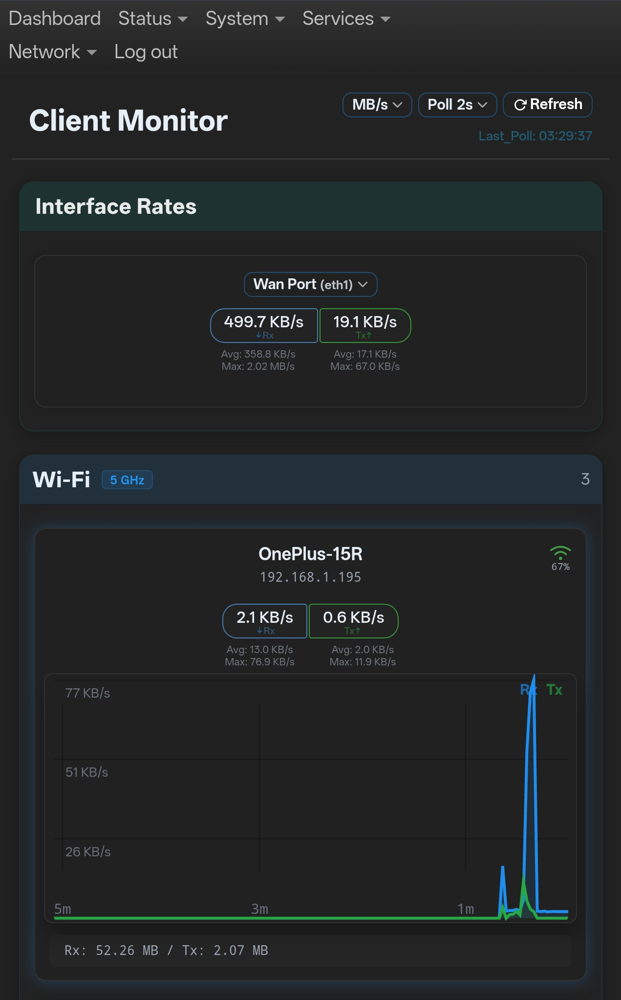

# Luci Client Monitoring

Real-time client traffic monitoring for OpenWrt LuCI. Live per-client Rx/Tx rates, 5-minute rolling graphs, bridge/AP detection, and interface rate cards — all rendered in the LuCI web UI with no external services or build tools.

---

**Official upstream repository for the OpenWrt luci-app-client-monitor package.**

## Installation

### For OpenWrt v25.12 or newer (.apk)

```bash
apk update && \
wget --no-check-certificate -O /tmp/luci-app-client-monitor.apk "https://github.com/OppsError404/luci-app-client-monitor/releases/download/v1.0.0-r1/luci-app-client-monitor-1.0.0-r1.apk" && \
apk add --allow-untrusted /tmp/luci-app-client-monitor.apk && \
rm -f /tmp/luci-app-client-monitor.apk
```

### For OpenWrt v24.10.5 or older (.ipk)

```bash
opkg update && \
wget --no-check-certificate -O /tmp/luci-app-client-monitor.ipk "https://github.com/OppsError404/luci-app-client-monitor/releases/download/v1.0.0-r1/luci-app-client-monitor_1.0.0-r1.ipk" && \
opkg install /tmp/luci-app-client-monitor.ipk && \
rm -f /tmp/luci-app-client-monitor.ipk
```

After installation, navigate to **Services → Client Monitor** in the LuCI web interface.

## Uninstallation

### For OpenWrt v25.12 or newer (.apk)

```bash
apk del luci-app-client-monitor
```

### For OpenWrt v24.10.5 or older (.ipk)

```bash
opkg remove luci-app-client-monitor
```

---

## Features

`luci-app-client-monitor` provides a live, real-time view of every device connected to your router — their traffic rates, signal strength, and network topology — rendered entirely inside the LuCI web UI with no external services or build tools. It uses nftables bridge-family counters for per-MAC byte accounting, auto-discovers Wi-Fi, LAN, and bridge/AP clients, and runs an on-demand collector daemon that costs zero CPU when nobody is viewing the page.

### Live Client Monitoring

- **Real-time Rx/Tx rates** per client with configurable poll intervals (1, 2, 3, 5, 10 seconds)
- **5-minute rolling traffic graphs** — canvas-based, no Chart.js or CDN dependencies
- **Wi-Fi clients** grouped by band (2.4 GHz, 5 GHz, 6 GHz) with signal strength
- **Smart ESSID aggregation** — combines multiple APs sharing the same SSID into one card
- **LAN port monitoring** — physical Ethernet port activity with carrier detection
- **Bridge/AP detection** — shows devices behind bridges and access points as sub-clients
- **Interface rate cards** — WAN, LAN combined, wireless combined, VPN, smart ESSID
- **Device-type hint badges** — bridge, sub-AP, NAT gateway, router OUI, ethernet issue

### Data Collection

- **nftables bridge-family counting** — per-MAC byte counters in the `cm_monitor` table
- **Fork-optimized collector** — reads `/proc/net/arp`, `/proc/net/dev`, and sysfs directly; batches nft commands into single `nft -f` calls
- **Multi-source client discovery** — bridge FDB, ARP/neigh table, DHCP leases, wireless associations, UCI static hosts, `/etc/hosts`
- **Registry persistence** — client identities (hostname, IP, port) saved across reboots
- **Short-key JSON protocol** (v3.0) — minimal wire size for low-bandwidth polling

### Daemon Architecture

- **On-demand collector daemon** — started by rpcd when the first client polls; auto-exits after 60 s of inactivity
- **Zero cost when idle** — no CPU, no forks, no memory when nobody is viewing the page
- **Atomic file writes** — `data.json` is written via temp-file + rename to prevent partial reads
- **Cache TTLs** — ARP (15 s), interfaces (45 s), FDB (1 s), nft listing (5 s), DHCP leases (10 s)

### Frontend

- **Vanilla JavaScript** — no frameworks, no build step, no bundler
- **Responsive layout** — separate mobile and desktop views with CSS breakpoint at 980 px
- **Canvas graph renderer** — hover tooltips, pinned values, touch support, fade animations
- **IP/MAC toggle** — click any client to switch between IP and MAC display
- **Unit toggle** — switch between MB/s and Mbps
- **Force refresh** — bypass all caches and re-discover from scratch
- **Compressed assets** — CSS/JS gzipped in package, decompressed to RAM at boot

---

## Usage

### Web Interface

Navigate to **Services → Client Monitor** in the LuCI menu.

The interface shows:

- **Interface rate cards** — WAN, LAN combined, wireless combined, VPN tunnels, smart ESSID
- **Wi-Fi clients** — grouped by access point and band, with signal percentage and live rates
- **LAN clients** — one card per physical Ethernet port with carrier status
- **Bridge/AP clients** — devices detected behind bridges and access points

### Controls

| Control | Description |
|---------|-------------|
| **Poll interval** | Refresh rate: 1 s, 2 s, 3 s, 5 s, 10 s, or Off |
| **Unit toggle** | Switch between MB/s and Mbps |
| **Force refresh** | Bypass cache and re-discover all clients |
| **Card expand** | Click any client card to see totals and sub-clients |
| **IP/MAC toggle** | Click any client's IP/MAC field to switch display |

### Service Commands

```bash
/etc/init.d/client_monitor start       # Start service (decompress assets, AP discovery)
/etc/init.d/client_monitor stop         # Stop service and kill collector daemon
/etc/init.d/client_monitor restart      # Restart service
/etc/init.d/client_monitor enable       # Enable at boot
/etc/init.d/client_monitor disable      # Disable at boot
/etc/init.d/client_monitor status       # Show full service status
```

---

## Configuration

No UCI configuration file is required. The collector auto-discovers bridges, LAN ports, and access points. All runtime state lives in `/tmp/client_monitor/` and resets on reboot.

To force a full re-discovery:

```bash
# Via web UI: click the Refresh button
# Via CLI:
rm -f /tmp/client_monitor/.force_refresh
echo 1 > /tmp/client_monitor/.force_refresh
```

---

## Dependencies

### Required

| Package | Notes |
|---------|-------|
| `luci-base` | LuCI framework |
| `lua` | Lua runtime (5.1 or 5.4) |
| `luci-lib-nixio` | Filesystem, sleep, syslog |
| `luci-lib-base` | LuCI base libraries |
| `cgi-io` | CGI helper |
| `libubus-lua` | ubus Lua API |
| `libuci-lua` | UCI configuration API |

### System

| Package | Notes |
|---------|-------|
| `nftables` | Kernel bridge-family support for per-MAC counting |
| `ip-bridge` | `bridge fdb show` for FDB table access |


### Frontend (CDN)

- Font Awesome 6.5 (icon stylesheet only)

---

## URLs

```
/cgi-bin/luci/admin/services/client_monitor          # Web UI
/ubus  →  client_monitor.get_data                     # JSON data (ubus)
/ubus  →  client_monitor.force_refresh                # Clear cache (ubus)
```
---

## Notes

- Requires a kernel with **nftables bridge family** support (standard on OpenWrt 23+).
- The collector daemon is **on-demand only** — it starts when a browser opens the page and stops after 60 s of no polling.
- All cache files live in `/tmp` and reset on reboot. The registry persists client identities but is rebuilt from scratch if deleted.
- Static assets (JS/CSS) are shipped gzip-compressed and decompressed to `/tmp` at boot to minimize flash storage.
- The `ap_monitor` script is triggered by wireless hotplug events to discover AP interfaces and write `/tmp/test/current-aps.json`.
- The frontend uses a short-key JSON protocol (v3.0) to minimize payload size on low-bandwidth links.

---

## Screenshots

### Core Interface Layout


### Advanced Client Tracking


### Mobile Responsive Layout


---

## License

MIT license.

## Support

Report issues with:
- OpenWrt version and hardware
- Network topology description (bridges, APs, VLANs)

## See Also
* [luci-app-dashboard]([https://github.com](https://github.com/OppsError404/luci-app-dashboard)) - Realtime system monitoring dashboard and vnStat backup manager.

